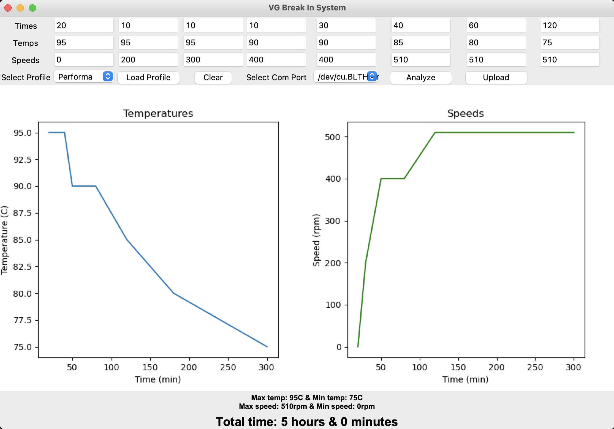

# Controller software for the VG-Break-In system

## Requirements
- Arduino CLI
- Python 3

## Installation
1. Install [Arduino CLI ](https://arduino.github.io/arduino-cli/0.31/installation/)
2. Install Python3
3. Install Python requirements `pip install -r requirements.txt`

## Usage 
1. Connect the machine to the computer via USB
2. Run `python main.py`
3. Select a profile from the list
4. Click `load` to load the profile
5. Click `analyze` to analyze the profile
6. Select the COM port of the machine
7. Click `upload` to upload the profile to the machine

## Settings
`settings.json` - stores the PID parameters for the machine and the different engine profiles. To change the settings, edit the file and restart the program.

### PID parameters
The PID parameters can be changed to alter the behavior of the heating loop. 

- `Kp` - proportional gain
- `Ki` - integral gain
- `Kd` - derivative gain

### Engine profiles
- `name` - the name of the profile, this is what is displayed in load menu.
- `times` - a list of times in minutes were each element represents a sequence.
- `speeds` - a list of speeds in RPM were each element represents what speed the engine should run at for the corresponding time in `times`.
- `temps` - a list of temperatures in degrees Celsius were each element represents what temperature the machine should run at for the corresponding time in `times`.

#### Adding a new Engine profile
1. Locate the "engines" array within the JSON structure. It contains the configurations of the existing engines.

2. Create a new JSON object within the `engines` array. This object will represent the new engine.

3. Provide the necessary information for the new engine:

- Name: Specify the name of the new engine it must be unique.
- times: Enter an array of time values for the engine. Each value represents a specific time interval during the break in.
- temps: Provide an array of temperature values corresponding to the time intervals defined in the "times" array.
- speeds: Enter an array of speed values representing the engine's speed at each corresponding time interval defined in the "times" array.

4. Save the JSON file with the new engine configuration added.

